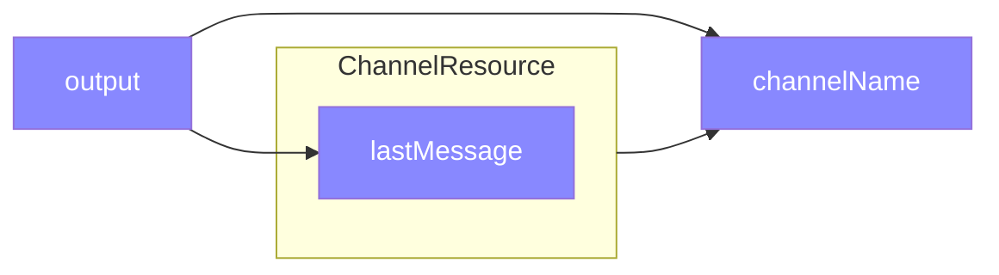
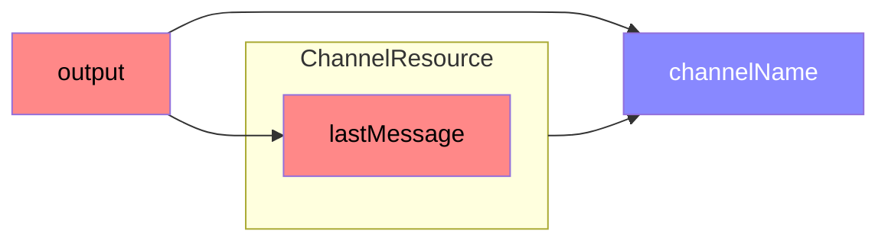
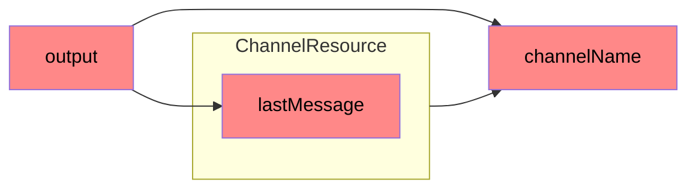

# Resources

_this document has been adapted/copied[^copying] from the Starbeam[^starbeam] documentation_


This is a highlevel introduction to Resources, and how to use them.
For how to integrate Resources in to Ember (Components, etc), see ['./ember.md]('./ember.md'); 

In addition to the live demos accompanying each code snippet, all code snippets will have their starbeam counterparts below them, so that folks can see how similar the libraries are.

When Starbeam is integrated in to Ember, there will be a codemod to convert from ember-resources' APIs to Starbeam's APIs. 

_details on that soon_


<hr>


> **NOTE** <br> A resource is a reactive function with cleanup logic.

Resources are created with an owner, and whenever the owner is cleaned up, the resource is also cleaned up. This is called ownership linking.

Typically, a component in your framework will own your resources. The framework renderer will make sure that when your component is unmounted, its associated resources are cleaned up.

<details>
<summary>Resources Convert Processes Into Values</summary>

Typically, a resource converts an imperative, stateful process, such as an asynchronous request or a ticking timer, into a reactive value.

That allows you to work with a process just like you'd work with any other reactive value.

This is a very powerful capability, because it means that adding cleanup logic to an existing reactive value doesn't change the code that works with the value.

The only thing that changes when you convert a reactive value into a resource is that it must be instantiated with an owner. The owner defines the resource's lifetime. Once you've instantiated a resource, the value behaves like any other reactive value.

</details>

## A Very Simple Resource

To illustrate the concept, let's create a simple resource that represents the current time.

```js 
import { cell, resource } from "ember-resources";
 
export const Now = resource(({ on }) => {
  const now = cell(Date.now());
 
  const timer = setInterval(() => {
    now.set(Date.now());
  });
 
  on.cleanup(() => {
    clearInterval(timer);
  });
 
  return now;
});
```

To see this code in action, [checkout the live demo](https://limber.glimdown.com/edit?c=MQAggiDKAuD2AOB3AhtAxgCwFBbbAJgKYgBmhAdmsdMgOYDOIay5IARsQK72H4hwh8ASwBOhNNAA2ATxBjyREU1gBbeLHIVo9ADRZkjRIUmSQBuRUX8MxPERD1yQ%2BPELRrxSUIButgn5VCRhIRVQA6HAB5eGghDXoALhwAWhAAAy9fNJBUgH15RUYhVnhJZCpcrFSMn2J4MW8hQkRs-MtCESKSsqodEFLy4toPB1hOESozEmgOkcziAo7K6vn%2BhqbEdmNYFpA2hQ6u-p7CPoG0IbnaiwOlDkkdkfoxicJKrDTP2gArRnmsIRqWAidwAbwsz3GvSYxlMAF9SKEVCAAOSEFQcETJMSQ170FEAbhwhAAHuoQcpyPR3AA5R4AXghLyoAAoWeCNCA4QBKED0gB8IFBWBAlOpIHIDJhJhZABFUIQwpLECzudyiSARWL3LFAkpGTxoABJcgzETeZCSNm8gVCrWi5VhQ1yhVKnaq9VankarUaMJoSSEFiceDWvmC4Wi0UBoMiE1mi1W3UdT2i71arViaDjVjKonpnAAHhmajKM35WqN7iEiRAxcBhH5oNBdMQcLhhYA9MmK12SwNyx9PkA&format=glimdown).

<details><summary>In Starbeam</summary>

```js 
import { Cell, Resource } from "@starbeam/universal";
 
export const Now = Resource(({ on }) => {
  const now = Cell(Date.now());
 
  const timer = setInterval(() => {
    now.set(Date.now());
  });
 
  on.cleanup(() => {
    clearInterval(timer);
  });
 
  return now;
});
```

</details>


> **💡** A resource's return value is a reactive value. If your resource represents a single cell, it's fine to return it directly. It's also common to return a function which returns reactive data -- that depends on reactive state that you created inside the resource constructor.

When you use the `Now` resource in a component, it will automatically get its lifetime linked to that component. In this case, that means that the interval will be cleaned up when the component is destroyed.

The `resource` function creates a resource Constructor. A resource constructor:

1. Sets up internal reactive state that changes over time.
2. Sets up the external process that needs to be cleaned up.
3. Registers the cleanup code that will run when the resource is cleaned up.
4. Returns a reactive value that represents the current state of the resource as a value.

In this case:

| internal state | external process | cleanup code | return value |
| ---- | ---- | ---- | ---- |
| `Cell<number>` | `setInterval` | `clearInterval` | `Cell<number>` |


<details><summary>Resource's values are immutable</summary>

When you return a reactive value from a resource, it will always behave like a generic, immutable reactive value. This means that if you return a `Cell` from a resource, the resource's value will have `.current` and `.read()`, but not `.set()`, `.update()` or other cell-specific methods.

If you want your resource to return a value that can support mutation, you can return a JavaScript object with accessors and methods that can be used to mutate the value.

This is an advanced use-case because you will need to think about how external mutations should affect the running process. 

</details>

## A Ticking Stopwatch

Here's a demo of a `Stapwatch` resource, similar to the above demo.
The main difference here is that the return value is a function.

```js 
import { cell, resource } from "@starbeam/universal";

const formatter = new Intl.DateTimeFormat("en-US", {
  hour: "numeric",
  minute: "numeric",
  second: "numeric",
  hour12: false,
});

export const Stopwatch = resource((r) => {
  const time = cell(new Date());

  const interval = setInterval(() => {
    time.set(new Date());
  }, 1000);

  r.on.cleanup(() => {
    clearInterval(interval);
  });

  return () => {
    const now = time.current;

    return formatter.format(now);
  };
});
```

To see this code in action, [checkout the live demo](https://limber.glimdown.com/edit?c=MQAggiDKAuD2AOB3AhtAxgCwFBbbAJgKYgBmhAdmsdMgOYDOIay5IARsQK72H4hwh8ASwBOhNNAA2ATxBjyREU1gBbeLHIVo9ADRZkjRIUmSQBuRUX8MxPERD1yQ%2BPELRrxSUIButgn5VCRhIRVQA6HAB5eGghDXoALhwAWhAAAy9fNJBUgH15RUYhVnhJZCpcrFSMn2J4MW8hQkRs-MtCESKSsqodEFLy4toPB1hOESozEmgOkcziAo7K6vn%2BhqbEdmNYFpA2hQ6u-p7CPoG0IbnaiwOlDkkdkfoxicJKrDTP2gArRnmsIRqWAidwAbwsz3GvSYxlMAF9SKEVCAAOSEFQcETJMSQ170FEAbhweHI9HcJGBKlQMyUAF4QJpNgBJchSMIAEVQhAAKoDCAAxSmoAAUACIKMkAKqQUV9UFYEAgDAvBIgUXkTiBERCNCyhUgFTFTgzVXqzUdHV6xU8En4U0arWWvSK5XjACMACZVSRkJIeHo4QBKIm4eLuGAIFDoDAgek4l5UYXC8EaEBB2MAPhA8sVJLJ-D5sZhJmFjJAnJmwsDwf1efcxRp3l9RZ40BZjd9ScDmYLgTCaHG8nc9LLFcIVb6boADDOa-qNP3JIQWJx4F2e2gl8gRO2Ok3JMKG3vfdWQ4qxNBxqwqz2c4rlKT3ORHvTYn2ByIh2f7xer6QhdANJhBSIhUtApY7DWipwlgQYhgAPDMahlDMGb6ky9aJCAiF8hmoKghGSCoJgcJwvBAD0b6EGhFFIQMqEfJ8QA&format=glimdown).

<details><summary>In Starbeam</summary>

```js
import { Cell, Formula, Resource } from "@starbeam/universal";

export const Stopwatch = Resource((r) => {
  const time = Cell(new Date());

  const interval = setInterval(() => {
    time.set(new Date());
  }, 1000);

  r.on.cleanup(() => {
    clearInterval(interval);
  });

  return Formula(() => {
    const now = time.current;

    return new Intl.DateTimeFormat("en-US", {
      hour: "numeric",
      minute: "numeric",
      second: "numeric",
      hour12: false,
    }).format(now);
  });
});
```

</details>

A description of the `Stopwatch` resource:

| internal state | external process | cleanup code | return value |
| ---- | ---- | ---- | ---- |
| `Cell<Date>` | `setInterval` | `clearInterval` | `string` |

The internals of the `Stopwatch` resource behave very similarly to the `Now` resource. The main difference is that the `Stopwatch` resource returns the time as a formatted string.

From the perspective of the code that uses the stopwatch, the return value is a normal reactive string.

## Reusing the `Now` Resource in `Stopwatch`

You might be thinking that `Stopwatch` reimplements a whole bunch of `Now`, and you ought to be able to just use `Now` directly inside of `Stopwatch`.

You'd be right!

```js 
const formatter = new Intl.DateTimeFormat("en-US", {
  hour: "numeric",
  minute: "numeric",
  second: "numeric",
  hour12: false,
});
 
const Stopwatch = resource(({ use }) => {
  const time = use(Now);
         
  return () => formatter.format(time.current);
});
```

<details><summary>In Starbeam</summary>

```js 
const formatter = new Intl.DateTimeFormat("en-US", {
  hour: "numeric",
  minute: "numeric",
  second: "numeric",
  hour12: false,
});
 
const Stopwatch = Resource(({ use }) => {
  const time = use(Now);
         
  return Formula(() => formatter.format(time.current));
});
```

</details>

The `Stopwatch` resource instantiated a `Now` resource using its use method. That automatically links the `Now` instance to the owner of the `Stopwatch`, which means that when the component that instantiated the stopwatch is unmounted, the interval will be cleaned up.

## Using a Resource to Represent an Open Channel

Resources can do more than represent data like a ticking clock. You can use a resource with any long-running process, as long as you can represent it meaningfully as a "current value".

<details><summany>Compared to other systems: Destiny of Unused Values</summary>

You might be thinking that resources sound a lot like other systems that convert long-running processes into a stream of values (such as observables).

While there are similarities between Resources and stream-based systems, there is an important distinction: because Resources only produce values on demand, they naturally ignore computing values that would never be used.

This includes values that would be superseded before they're used and values that would never be used because the resource was cleaned up before they were demanded.

**This means that resources are not appropriate if you need to fully compute values that aren't used by consumers.**

In stream-based systems, there are elaborate ways to use scheduling or lazy reducer patterns to get similar behavior. These approaches tend to be hard to understand and difficult to compose, because the rules are in a global scheduler, not the definition of the stream itself. These patterns also give rise to distinctions like "hot" and "cold" observables.

On the other hand, Starbeam Resources naturally avoid computing values that are never used by construction.

TL;DR Starbeam Resources do not represent a stream of values that you operate on using stream operators.

> **Key Point** <br> Starbeam resources represent a single reactive value that is always up to date when demanded.

This also allows you to use Starbeam resources and other values interchangably in functions, and even pass them to functions that expect reactive values.

</details>

Let's take a look at an example of a resource that receives messages on a channel, and returns a string representing the last message it received.

In this example, the channel name that we're subscribing to is dynamic, and we want to unsubscribe from the channel whenever the channel name changes, but not when we get a new message.

```js 
import { resourceFactory, resource, cell } from 'ember-resources';

const ChannelResource = resourceFactory((channelName) => {
  return resource(({ on }) => {
    const lastMessage = cell(null);
 
    const channel = Channel.subscribe(channelName);
 
    channel.onMessage((message) => {
      lastMessage.set(message);
    });
 
    on.cleanup(() => {
      channel.unsubscribe();
    });
 
    return () => {
      const prefix = `[${channelName}] `;
      if (lastMessage.current === null) {
        return `${prefix} No messages received yet`;
      } /*E1*/ else {
        return `${prefix} ${lastMessage.current}`;
      }
    };
  });
});
```

To see this code in action, [checkout the live demo](https://limber.glimdown.com/edit?c=MQAgMglgtgRgpgJxAUQCYQC4HsEChcDGWqcIAZnAHYGkYCGA5gM4gF2UjwgCuTcqIbCHQI4BDABsAniFGUSSIlAAOWSlQxMANLjosA7nAkSQe2VQWCAFqSIkQTShGXK4Ga6QkQAbreJ%2BoOBYyBCwoADp8AHllDAg1JgAufABaEAADL190kDSAfTkFFggOZQk6GjzcNMyfUmVRbwg4fRyCi0Ri0vKaLRAyipKGDwcsbgQaUzIMRBGs0kLEKpr5-sbm-U4jLFaQdvlOkBL%2Bnrg%2BgYIhubrzA6R4CR2RpjGJuCrcdK%2BGACsWedw0FUCHcAG9zC9xjQAGIVbAIKR9USQt59GjGEAAX3IoSgIAA5HBYIgUsjXjQmPiANz4AD0ACp6SAAAqiGbyEAAYSs7HUJiBEiJGjocTU5BwnHWGBk9NphAS7m5vKMIAAvCBQbgQA5uDAmAQEBB4IkQAAKAg8yh8gBydECAEo1QA%2BDVa7UgQXuNjGGAVADWLHVAG0ALo0t3a2m0hzQbjlGbmGg%2BK4vAh%2BtwgQJMJiMIL9RDxdDe6QRj0ZkozBDeOgmdV8DAASUolerElNpsdqpdmvd7s9RwE6oAsiKrOFQtx5KaRxgxwh2Kgwh2QEyABwABkdAGoQABGGm97X9ngIWsZKwYDDKJJRpj6OjKCDhEjeWkPiC0gAkoItyoktsCTEv1BCBUExdJ8EPcg3AtU1xgke1S17cJZyoU1kVUSg%2BGdCFML4cI-jUDtEKg7UUJsShTVQEU6BwntSO1YtfTTJhwigB9zRrCRmL9HCmP9KiaPCSg7Tge0SNIzF7QPd1MT6Xd10U6TIPdNlxg4ejezUIcghzBg4BNU0yEoTsXX4ljwmUXgrCMkydCgycmF1fVDWNM1TNdBjzIDNUQFDGSoIIQU6AQJsWxrU0K0QVtlKgzFS3i7V4vi-AiCwxVLT5AAlIJyVIdUyShOBYXEHApHbX8rSMACxLot01IQDhCredtwTFKS6t7NKmHccoep07Nc189E20oOMEIPUtuq9TKVXVJUqokcInL1A0jTgc1Zv-UTYqmrbwm03Tc3bLM9NqrtPMPPqMAGs7lrcU1TtzWLZN2rTKHCIK4HYbhlHbDzNPdSq%2BXCRznLW%2BAOwCrE3tUtx1PczrD2mtY4DICAAA9fPSINv2B6rRMxEMMmh7UIDIM1rtu3NPvGOR3FVRmQDG4xHUB3sGo4dJvwaNHMexa0sEzI79JYUQk18AQpDcdJSaxEAGWQXdZRAIxsPZuGMAR7nQV59GMexb8qZFuBaYQenwLlxLZJkqSaTt-AAB4ZhUeM4CdN1HfQbwHGlQVVQAIhgHAFBNXdlCxl4vFQKl%2BjoVB0EoBgw9EKAqQDj3e1BUEFuy3KipAAPXCwMo4ADzFrcd2lvY9quXYGGYPa%2BCCgA&format=glimdown)

<details><summary>In Starbeam</summary>

```js 
import { Resource, Cell, Formula } from '@starbeam/universal';

function ChannelResource(channelName) {
  return Resource(({ on }) => {
    const lastMessage = Cell(null);
 
    const channel = Channel.subscribe(channelName.read());
 
    channel.onMessage((message) => {
      lastMessage.set(message);
    });
 
    on.cleanup(() => {
      channel.unsubscribe();
    });
 
    return Formula(() => {
      const prefix = `[${channelName.read()}] `;
      if (lastMessage.current === null) {
        return `${prefix} No messages received yet`;
      } /*E1*/ else {
        return `${prefix} ${lastMessage.current}`;
      }
    });
  });
}
```

</details>

`ChannelResource` is a JavaScript function that takes the channel name as a reactive input and returns a resource constructor.

That resource constructor starts by subscribing to the current value of the `channelName`, and then telling ember to unsubscribe from the channel when the resource is cleaned up.

It then creates a cell that holds the last message it received on the channel, and returns a function that returns that message as a formatted string (or a helpful message if the channel hasn't received any messages yet).

At this point, let's take a look at the dependencies:



Our output depends on the channel name and the last message received on that channel. The lastMessage depends on the channel name as well, and whenever the channel name changes, the resource is cleaned up and the channel is unsubscribed.

If we receive a new message, the lastMessage cell is set to the new message. This invalidates lastMessage and therefore the output as well.



However, this does not invalidate the resource itself, so the channel subscription remains active.

On the other hand, if we change the channelName, that invalidates the ChannelResource itself.



As a result, the resource will be cleaned up and the channel unsubscribed. After that, the resource will be re-created from the new channelName, and the process will continue.


> **Key Point** <br> From the perspective of the creator of a resource, the resource represents a stable reactive value.

<details><summary>Under the hood</summary>

Under the hood, the internal `ChannelResource` instance is cleaned up and recreated whenever its inputs change. However, the resource you got back when you created it remains the same.
</details>


----------------------------------------

[^starbeam]: These docs have been adapted from the [Starbeam](https://www.starbeamjs.com/guides/fundamentals/resources.html) docs on Resources.

[^copying]: while ~90% of the content is copied, adjustments have been made for casing of APIs, as well as omissions / additions as relevant to the ember ecosystem right now. Starbeam is focused on _Universal Reactivity_, which in documentation for Ember, we don't need to focus on in this document. Also, mega huge thanks to [@wycats](https://github.com/wycats) who wrote most of this documentation. I, `@nullvoxpopuli`, am often super stressed by documentation writing (at least when stakes are high) -- I am much happier/relatex writing code, and getting on the same page between our two projects.
